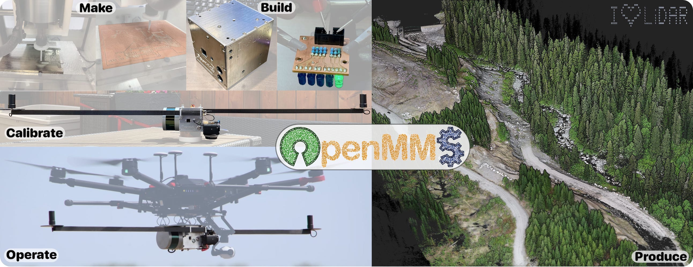
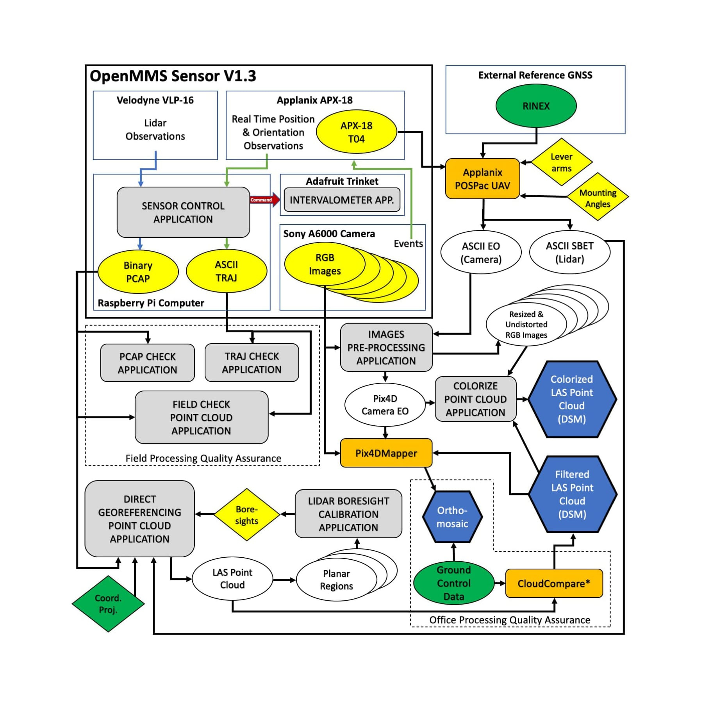

<h2 align="center">AN OPEN-SOURCE SOFTWARE AND HARDWARE PROJECT</h2>

 <b><a href="./sensor_firmware">OpenMMS Real-Time Sensor Applications</a></b> 
 <b><a href="./post_processing">OpenMMS Data Post-Processing Applications</a></b>  
 <b>View the <a href="https://www.openmms.org">OpenMMS website</a> for complete project documentation, information and news!</b> 

<h3 align="center">********** PROJECT UPDATES **********</h3>

 - GitHub Publication started, May 5th, 2019 
 - Development effort to include NVidia GPU CUDA processing within OpenMMS applications started, May 2020 
  - Version 1.3 publication completed, July 7th, 2020 

 

