<p align="center">
  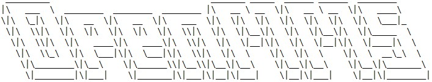
</p>

<h1>OpenMMS Post-Processing Software</h1>

<b>Click <a href="https://github.com/ryan-brazeal-ufl/OpenMMS/raw/master/post_processing/OpenMMS.zip">HERE</a> to download the compressed (.zip) file that contains all the OpenMMS post-processing software and instructions, exactly as shown within the subdirectories and files above. </b>

| IMPORTANT NOTES | 
| ---------------|
| The current OpenMMS Hardware utilizes an Applanix GNSS-INS sensor, and therefore requires the use of the Applanix POSPac software application in order to process the .T04 file collected from an OpenMMS sensor. **Currently, POSPac can ONLY be installed within a Windows OS environment.** |
| A current development effort is underway (started May 2020), to leverage NVidia CUDA GPU processing techniques within the OpenMMS software suite for the Windows 10 OS. Future versions of the OpenMMS applications will support NVidia CUDA processing, when possible. |

<p align="center">

</p>
<hr>
<h3>Data Processing Applications Overview</h3>
<p>
The following commandline-based Python3 applications are installed on a user's computer, and provide the user with a set of tools for handling all the required MMS data related tasks. The applications have been optimized for performance and speed by utilizing multi-core processing whenever possible.
</p>

| 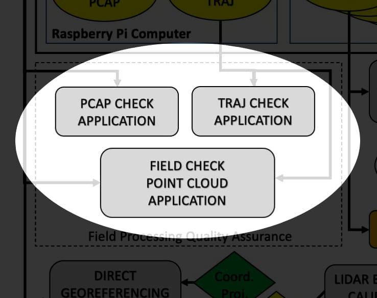 | 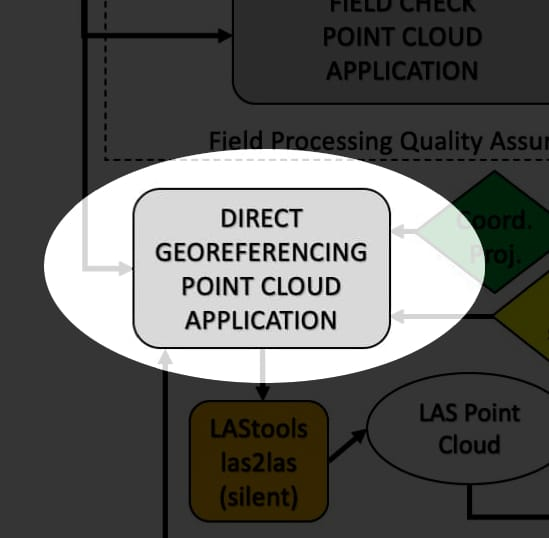 | 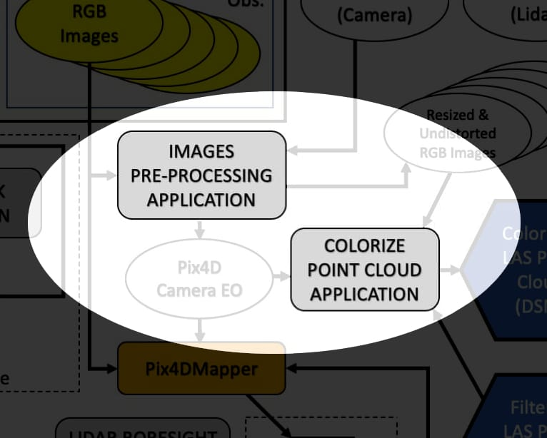 |
|------------------------------------|------------------------------------|------------------------------------|

<p>
The trigger files for both Windows and Mac OS are also shown here for reference, and general information. The trigger files are a key part of the current OpenMMS software, and provide an easy-to-use and systematic approach to the complex numerical computations that are involved with producing high quality Mobile Mapping datasets. A complete explanation, and demonstration, of the OpenMMS processing approach can be found on the <a href="https://www.openmms.org">OpenMMS website</a>.
</p>
  
| OpenMMS Application | Windows Batch Trigger | Mac/Linux Bash Trigger |
| --------------------|-----------------------|------------------------|
| <a href="./code/openmms_pcap_check.py">openmms_pcap_check.py</a> | <a href="./win_batch_files/1_pcap_check.bat">1_pcap_check.bat</a> | <a href="./mac_bash_files/1_pcap_check">1_pcap_check</a> |
| <a href="./code/openmms_traj_convert.py">openmms_traj_convert.py</a> | <a href="./win_batch_files/2_traj_convert.bat">2_traj_convert.bat</a> | <a href="./mac_bash_files/2_traj_convert">2_traj_convert</a> |
| <a href="./code/openmms_georeference.py">openmms_georeference.py</a> | <a href="./win_batch_files/3_quick_georef_WGS84_UTM13.bat">3_quick_georef_WGS84_UTM13.bat</a> <br> <a href="./win_batch_files/4_verbose_georef_WGS84_UTM13.bat">4_verbose_georef_WGS84_UTM13.bat</a> <br> <a href="./win_batch_files/6_full_georef_WGS84_UTM13.bat">6_full_georef_WGS84_UTM13.bat</a> | <a href="./mac_bash_files/3_quick_georef_WGS84_UTM13">3_quick_georef_WGS84_UTM13</a> <br> <a href="./mac_bash_files/4_verbose_georef_WGS84_UTM13">4_verbose_georef_WGS84_UTM13</a> <br> <a href="./mac_bash_files/6_full_georef_WGS84_UTM13">6_full_georef_WGS84_UTM13</a> |
| <a href="./code/openmms_preprocess_images.py">openmms_preprocess_images.py</a> | <a href="./win_batch_files/7_preprocess_images.bat">7_preprocess_images.bat</a> | <a href="./mac_bash_files/7_preprocess_images">7_preprocess_images</a> |
| <a href="./code/openmms_colorize.py">openmms_colorize.py</a> | <a href="./win_batch_files/9_colorize_las.bat">9_colorize_las.bat</a> | <a href="./mac_bash_files/9_colorize_las">9_colorize_las</a> |

<hr>
<h3>Sensor Calibration Applications Overview</h3>

<p>The following commandline-based Python3 applications are installed on a user's computer, and provides the user with a novel approach to estimating the boresight alignment angles for the OpenMMS lidar sensor and Sony A6000 mapping camera. The lidar sensor boresight calibration approach attempts to determine the optimal set of boresight alignment angles that minimize the RMS values for a set of best-fit planar surfaces that correspond to manually identified planar sections within a post-processed point cloud. The mapping camera boresight calibration approach attempts to determine the optimal set of boresight alignment angles and offsets (with respect to the lidar sensor) that minimize the differences between the GNSS-INS estimated exterior orientation parameters of the collected images, and the exterior orientation parameters estimated via the bundle adjustment results from a commercial photogrammetry/SfM software (Pix4D currently).</p>
<p>A novel procedure for precisely estimating the lever-arm offsets between the GNSS antennas and the Applanix sensor, via a total station/theodolite intersection survey, is also included. A Microsoft Excel spreadsheet is provided, where the survey observations are simply entered into the spreadsheet and automatically all the calculations are performed, and the lever-arm offset values are estimated and displayed. The new lever-arm offset values then need to be entered into the Applanix sensor's firmware, via its WebUI. See the <a href="https://www.openmms.org">OpenMMS website</a> for complete details.</p>

<p align="center">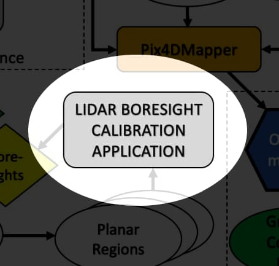</p>

| OpenMMS Application | Windows Batch Trigger | Mac/Linux Bash Trigger | 
| --------------------|-----------------------|----------------------- |
| <a href="./code/openmms_vlp16_calibration.py">openmms_vlp16_calibration.py</a> | <a href="./win_batch_files/5_vlp16_calibration.bat">5_vlp16_calibration.bat</a> | <a href="./mac_bash_files/5_vlp16_calibration">5_vlp16_calibration</a> |
| <a href="./code/openmms_vlp16_calibration_CUDA.py">openmms_vlp16_calibration_CUDA.py</a> | <a href="./win_batch_files/5_vlp16_calibration_CUDA.bat">5_vlp16_calibration_CUDA.bat</a> | N/A |
| <a href="./code/openmms_camera_calibration.py">openmms_camera_calibration.py</a> | <a href="./win_batch_files/8_camera_calibration.bat">8_camera_calibration.bat</a> | <a href="./mac_bash_files/8_camera_calibration">8_camera_calibration</a> |
| <a href="https://github.com/ryan-brazeal-ufl/OpenMMS/raw/master/post_processing/code/openmms_lever_cal.xlsx">openmms_lever_cal.xlsx</a> | N/A | N/A |

<hr>
<h3>Installation</h3>
<h4>1. Python3</h4>
<p>
Download the latest 64-bit Python 3.7.X release from the <a href="https://www.python.org/downloads">Python.org</a> website and install it on a computer. Ensure that the python executable location is added to the computer's PATH variable (there should be a checkbox within the Python installer) <b>OR,</b> if the user is familiar and comfortable with setting up virtual environments, this approach is <b>recommended.</b>
</p>
<h4>2. OpenMMS Applications</h4>
<p>
Installing OpenMMS Open-Source Software (OpenMMS_OSS) is very simple, and very primitive at the current time. The downloaded OpenMMS.zip file needs to be extracted to the root drive of a computer. This means the C:\ drive for Windows computers, and the / drive for Mac computers (reachable via the Macintosh HD location in Finder), see the images below. <b>DO NOT CHANGE THE NAME OF ANY DIRECTORY OR FILE!</b>
</p>

| Install Location on Windows OS | Install Location on Mac OS |
|--------------------------------|----------------------------|
| 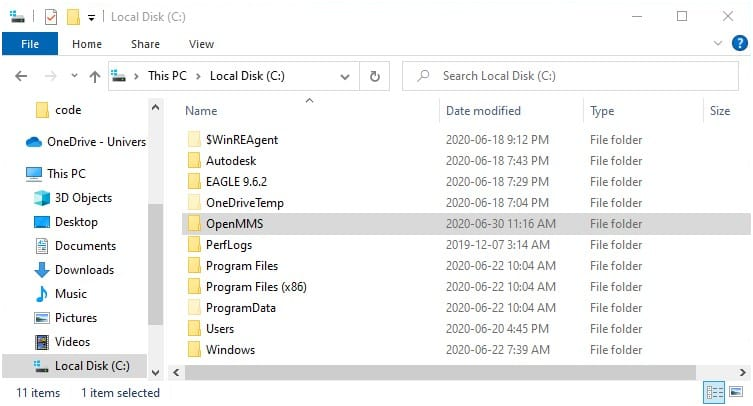 | 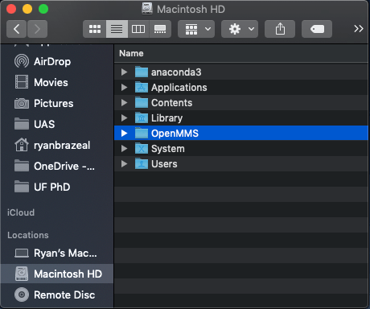 |

<h4>3. Python3 Dependencies</h4>
<p>
  Browse to the OpenMMS directory installed on the root drive and open the <b>install</b> subdirectory. Open the appropriate subdirectory based on the computer OS, and lastly execute the <b>1_python3_dep_install(.bat)</b> file. A commandline/terminal window should open and begin 'pip installing' the necessary dependencies. The following lists the Python3 dependency installations required to support the OpenMMS Applications.
</p>

```
pip install colorama
pip install pyproj
pip install pillow
pip install tqdm
pip install numpy
pip install laspy
pip install scipy
pip install matplotlib
pip install numba
pip install numdifftools
pip install opencv-python
pip install scikit-learn
```

**A huge thank-you goes out to all the supporters and contributors of these awesome Python packages! This project would not have been possible without these packages providing a solid foundation!**

<h4>4. CloudCompare </h4>
<p>
Currently, the OpenMMS project utilizes the inspiring <a href="https://www.cloudcompare.org">CloudCompare</a> open-source 3D point cloud and mesh processing software, for specific visualization and analysis purposes. Download and install the latest version of CloudCompare from <a href="https://www.cloudcompare.org/release/index.html">HERE</a>, and use the default installation settings.
</p>

<h4>5. ***OPTIONAL*** NVidia CUDA Processing (Windows Only!)</h4>
<p>
For Windows OS users who also have a NVidia Graphics Card with CUDA processing capabilities installed in their computer, a few extra Python dependencies need to be installed. They can be installed by executing the <b>3_python3_dep_install_CUDA.bat</b> file in the install/Windows OS subdirectory. The following lists the Python3 dependency installations required to support NVidia CUDA GPU processing in the OpenMMS Applications (where possible).
</p>

```
pip install pycuda
pip install scikit-cuda
pip install -e git://github.com/lebedov/scikit-cuda#egg=scikit-cuda
```

<p>
The Python3 CUDA related dependencies, in-turn rely on the NVidia CUDA Toolkit, which is provided by NVidia directly. Currently, versions 10.0 to 11.0 of the Toolkit have been tested to work with the respective OpenMMS applications. A user can download, and then install, the NVidia CUDA Tookit from <a href="https://developer.nvidia.com/cuda-toolkit-archive">HERE</a>. The default installation options/settings should be ok to use.
</p>
<p>
However, the NVidia CUDA Toolkit requires that an appropriate version of the Microsoft Visual C++ Compiler be installed on the computer. A user can download, and then install, the MSVS Build Tools from <a href="https://visualstudio.microsoft.com/thank-you-downloading-visual-studio/?sku=BuildTools&rel=16">HERE</a>. When running the installer program, make sure that the Visual C++ Build Tools are selected to be installed (there should be a checkbox option under the Workloads section of the installer).
</p>
<p>
  NVidia has an <a href="https://docs.nvidia.com/cuda/cuda-installation-guide-microsoft-windows/index.html">Installation Guide for Windows</a> that provides more details on installing, testing, and utilizing the CUDA Toolkit.
</p>
<hr>
<h3>Thanks to rapidlasso!</h3>
<p>
In addition to all the foundational Python packages, many thanks go to the <a href="https://rapidlasso.com/">rapidlasso</a> team for the creation of <a href="https://rapidlasso.com/lastools/">LAStools</a>. The OpenMMS Georeferencing application utilizes the <a href="https://rapidlasso.com/lastools/las2las/">las2las</a> binaries (for Windows and for Mac/Linux) for efficiently merging multiple .LAS files together, and for assigning the point cloud's coordinate system within the file's header.
</p>
<hr>
<h3>Getting Started with Applanix POSPac UAV GNSS-Inertial Post-Processing Software (Windows Only!)</h3>
<p>
In order to produce the highest quality dataset for the positions and orientations of the OpenMMS sensor over the course of a data collection campaign, the GNSS and inertial observations made by the onboard Applanix APX-18 sensor need to processed. Details on how to install POSPac UAV and setup the License Manager are <b>NOT</b> included here. A user should <a href="https://www.applanix.com/contact.htm#tab-id_2D32010C23D94A207E646406EF960545_1">contact</a> the Applanix Technical Support Team with questions or for further assistance. The following steps must be completed in order to configure POSPac UAV to support OpenMMS processing.
</p>
<p>
  <b>1.</b> Make sure to open the application at least once after installing it. This sets up the necessary directories structure on the computer.
</p>
<p>
  <b>2.</b> With POSPac UAV closed, copy the <b>OpenMMS_Camera.xsd</b> and <b>OpenMMS_Export.xsd</b> files from the <i>C:\OpenMMS\install\Windows OS\POSPac UAV - OpenMMS Specific Install Instructions\v8.4\Format Profiles\</i> directory, to the <i>C:\ProgramData\Applanix\User Format Profiles\</i> directory. The <i>ProgramData</i> directory is hidden by default, so in order to access it the user will need to ensure viewing of hidden files and folders is enabled. 
</p>
<p>
  <b>3.</b> Next, copy the example <b>OpenMMS WGS84 UTM EGM96.postml</b> project template file from the <i>C:\OpenMMS\install\Windows OS\POSPac UAV - OpenMMS Specific Install Instructions\v8.4\Project Templates\</i> directory, to the <i>C:\Users\{USERNAME}\AppData\Roaming\Applanix\POSPac UAV\8.4\</i> directory. Where <i>{USERNAME}</i> would be replaced with the actual username logged into the computer. The <i>AppData</i> directory is also hidden by default, so in order to access it the user will need to ensure viewing of hidden files and folders is enabled.
</p>
<p>
  <b>4.</b> Open POSPac UAV, click the <i>File</i> Menu, then click on <i>Options</i>. Within the <i>Import and Process</i> section, select the options that match those shown in the following image. Click the <i>OK</i> button to finish. 
</p>
<p align="center">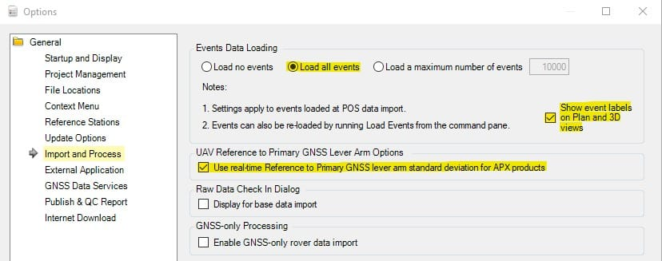</p>
<p>
  <b>5.</b> Click the <i>Project</i> Tab in the top menu of POSPac UAV. Click on <i>New Project</i>. The example <b>OpenMMS WGS84 UTM EGM96</b> should appear in the list of available project templates. Select the example template, then click the <i>OK</i> button.
</p>
<p align="center">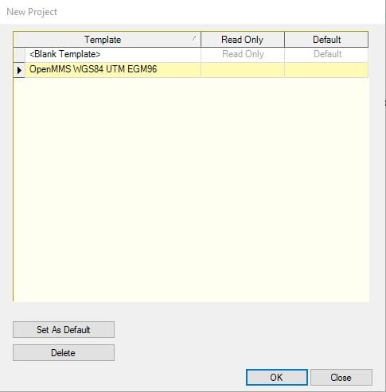</p>
<p>
  <b>6.</b> On the <i>Project</i> Tab, click on <i>Project Settings</i>. In the left column of the Project Settings dialog, click on <i>Export</i>, and then click on <i>Settings</i>. Make sure that <i>Output Format</i> dropbox shows <b>OpenMMS_Export</b>. Next, in the left column click on <i>Camera</i>, and then click on <i>Exterior Orientation</i>. Make sure that <i>Output Format</i> dropbox shows <b>OpenMMS_Camera</b>.
</p>

| 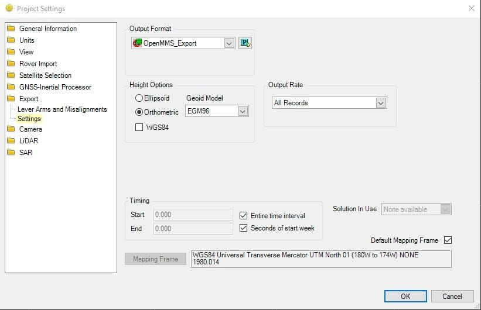 | 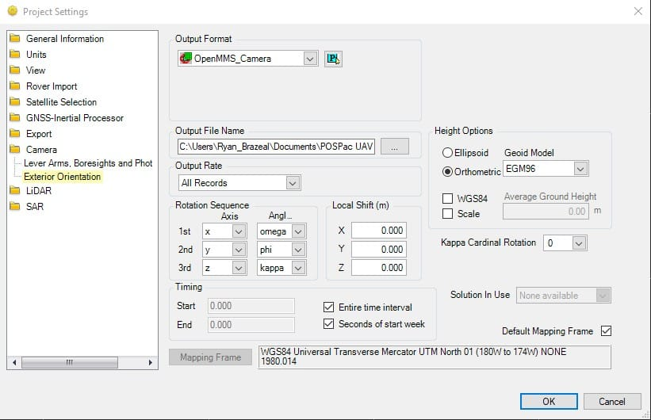 |
|--------------------------------------------------|--------------------------------------------------|

<p>
  <b>7.</b> If no errors have been encountered, POSPac UAV has been configured to support the OpenMMS processing approach.
</p>

<hr>
<p align="center"><br>

</p>
